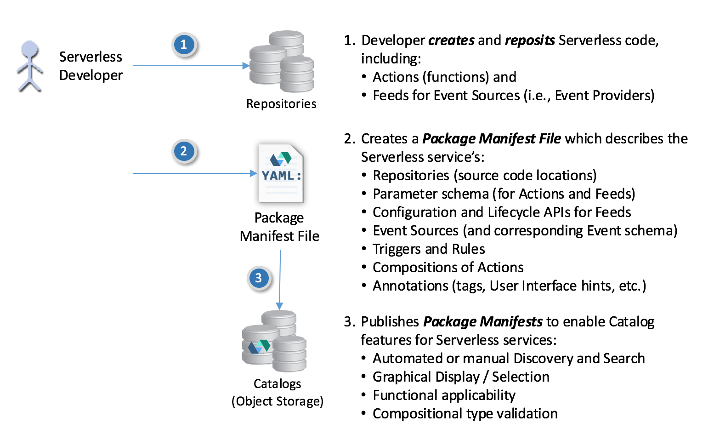
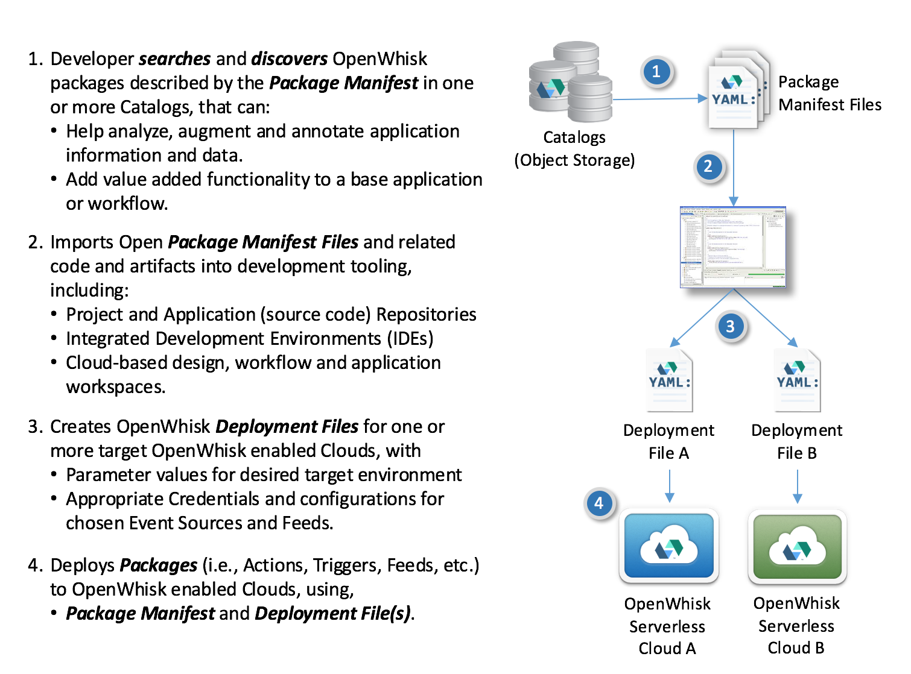

<!--
#
# Licensed to the Apache Software Foundation (ASF) under one or more
# contributor license agreements.  See the NOTICE file distributed with
# this work for additional information regarding copyright ownership.
# The ASF licenses this file to You under the Apache License, Version 2.0
# (the "License"); you may not use this file except in compliance with
# the License.  You may obtain a copy of the License at
#
#     http://www.apache.org/licenses/LICENSE-2.0
#
# Unless required by applicable law or agreed to in writing, software
# distributed under the License is distributed on an "AS IS" BASIS,
# WITHOUT WARRANTIES OR CONDITIONS OF ANY KIND, either express or implied.
# See the License for the specific language governing permissions and
# limitations under the License.
#
-->

## Package processing

This document defines two file artifacts that are used to deploy
Packages to a target OpenWhisk platform; these include:

- ***Package Manifest file***: Contains the Package definition along
    with any included Action, Trigger or Rule definitions that comprise
    the package. This file includes the schema of input and output data
    to each entity for validation purposes.

- ***Deployment file*** (optional): Contains the values and bindings used
    configure a Package to a target OpenWhisk platform provider’s
    environment and supply input parameter values for Packages, Actions
    and Triggers. This can include Namespace bindings, security and
    policy information.

#### Notes

- _Deployment files are optional_. Deployment can be fully accomplished
    with simply a Manifest File.

### Conceptual Package creation and publishing

The following diagram illustrates how a developer would create OpenWhisk
code artifacts and associate a Package Manifest file that describes them
for deployment and reuse.

### Conceptual tooling integration and deployment

The following diagram illustrates how Package manifests can be leveraged
by developer tooling to integrate OpenWhisk Serverless functions.

<!--
 Bottom Navigation
-->
---
<html>

<a href="../README.md#index">Index</a>

</html>
