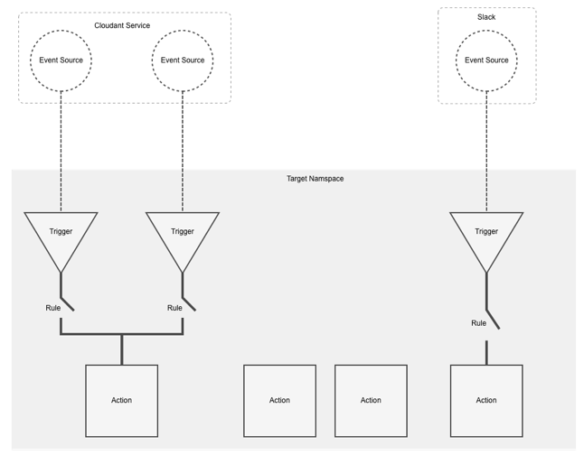

<!--
#
# Licensed to the Apache Software Foundation (ASF) under one or more
# contributor license agreements.  See the NOTICE file distributed with
# this work for additional information regarding copyright ownership.
# The ASF licenses this file to You under the Apache License, Version 2.0
# (the "License"); you may not use this file except in compliance with
# the License.  You may obtain a copy of the License at
#
#     http://www.apache.org/licenses/LICENSE-2.0
#
# Unless required by applicable law or agreed to in writing, software
# distributed under the License is distributed on an "AS IS" BASIS,
# WITHOUT WARRANTIES OR CONDITIONS OF ANY KIND, either express or implied.
# See the License for the specific language governing permissions and
# limitations under the License.
#
-->

## Programming model

### OpenWhisk Entities

OpenWhisk uses the following entities to describe its programming model:

#### Action

A stateless, relatively short-running function (*on the order of seconds
or even milliseconds*) invoked as an event handler.

#### Trigger

The name for a class of events. Triggers represent the events (and their
data) themselves without any concept of how they were generated.

#### Rule

A mapping from a Trigger to an Action which may contain simple
conditional logic. OpenWhisk evaluates incoming events (that belong to a
Trigger) and invokes the assigned Action (event handler).

#### Event Source

An Event Source is the descriptor (edge) for an Event Producer (or
provider). It describes the Event Format(s) produced, as well as any
configuration and subscription capabilities.

#### Feed

A Feed is an optional service that represents and controls the stream
which all belong to a Trigger. A feed provides operations called **feed
actions** which handle creating, deleting, pausing, and resuming the
stream of events. The feed action typically interacts with external
services which produce the events

#### Package

A named, shared collection of Actions and Feeds. The goal of this
specification is to describe OpenWhisk packages and their component
entities and resources to enable an open-ecosystem.

*Packages are designed to be first-class entities within the OpenWhisk
platform to be used by tooling such as catalogs (repositories),
associated package managers, installers, etc.*

*Note: Not all actions must belong to packages, but can exist under a
namespace.*

### Action Composition

#### Action Sequence

An Action that is a sequenced composition of 2 or more existing Actions.
The Action Sequence can be viewed as a named pipe where OpenWhisk can
automatically take the output of a first Action ‘A’ in a declared
sequence and provides it as input to the next Action ‘B’ in the sequence
and so on until the sequence completes.

*Note: This composition technique allows the reuse of existing action
implementations treating them as “building blocks” for other Actions.*

### Cardinality

#### Trigger to Action

With the appropriate set of Rules, it's possible for a single Trigger
(event) to invoke multiple Actions, or for an Action to be invoked as a
response to events from multiple Triggers.

### Conceptual representation

